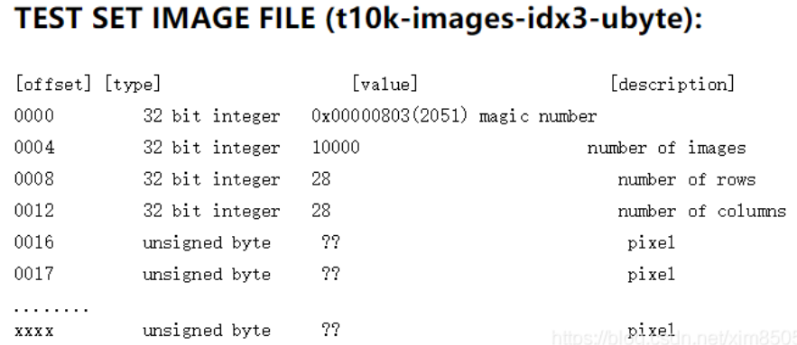
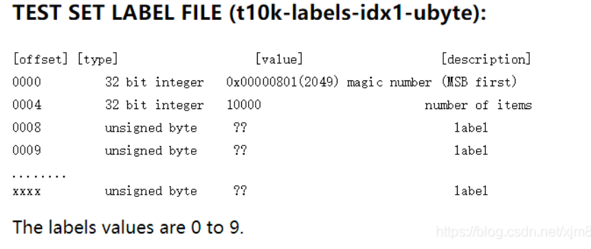
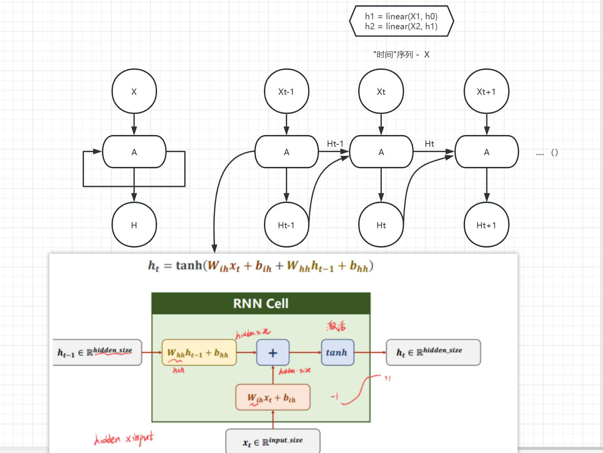

# 利用 RNN 网终实现 MINIST 手写体数字库的识别

## **MNIST 数据集**

| 名称                       | 大小     | 内容                          |
| :------------------------- | -------- | ----------------------------- |
| train-images-idx3-ubyte.gz | 9,681 kb | 55000 张训练集，5000 张验证集 |
| train-labels-idx1-ubyte.gz | 29 kb    | 训练集图片对应的标签          |
| t10k-images-idx3-ubyte.gz  | 1,611 kb | 10000 张测试集                |
| t10k-labels-idx1-ubyte.gz  | 5 kb     | 测试集图片对应的标签          |

· Image 文件内容：offset=16 前 16 位跳过不读，后面为图片像素*28*28

· Lable 文件内容：offset=4 前 4 位跳过不读，后面为标签 - byte 0~9

## **CNN 可视化**

https://poloclub.github.io/cnn-explainer/

## **RNN **·

-   BatchSize — 批量大小
-   SeqLen — 样本数量
-   InputSize — 输入维度
-   HiddenSize — 隐藏层（输出）维度

---

    input.shape = (batch_size, input_size)    output.shape = (batch_size, hidden_size)
    -->
    dataset.shape = (seqlen, batch_size, hidden_size)

---

## **小注**

### **_1. transforms.ToTensor()_**

### **_2. transforms.ToTensor()_**

一个图像预处理方法，用于将 PIL 图像或 NumPy 数组转换为 PyTorch 中的张量（torch.Tensor）

-   将 PIL 图像转换为 NumPy 数组。
-   将 NumPy 数组中的每个像素的值从 0 到 255 的整数转换为 0 到 1 的浮点数。
-   将 NumPy 数组转换为 PyTorch 中的张量，并交换维度顺序，使得通道数在第二个维度上。
     
    <code> #创建预处理管道 
    preps = transforms.Compose([transforms.Resize((224, 224)),transforms.ToTensor()])
      -- 处理后的图像转化为张量：
      输出一个大小为 (3, 224, 224) 的浮点数张量，第一个维度表示通道数，后两个维度表示图像宽和高。
    </code>

### **_3. torch.utils.data.DataLoader_**

-   dataset：加载的数据集(Dataset 对象)
-   batch_size：batch size
-   shuffle:：是否将数据打乱
-   sampler： 样本抽样
-   num_workers：使用多进程加载的进程数，0 代表不使用多进程
-   collate_fn： 如何将多个样本数据拼接成一个 batch，一般使用默认的拼接方式即可
-   pin_memory：是否将数据保存在 pin memory 区，pin memory 中的数据转到 GPU 会快一些
-   drop_last：dataset 中的数据个数可能不是 batch_size 的整数倍，drop_last 为 True 会将多出来不足一个 batch 的数据丢弃

### **_4. torch.nn.CrossEntropyLoss()_**

分类问题中常用的一个损失函数。它计算的是给定真实类标签的预测概率分布的负对数可能性。该函数将模型的预测输出和真实标签作为输入，并返回一个代表损失的标量值
$$ loss = -\frac{1}{n} \Sigma \Sigma y_i·\log{P_i}（n 为分类数【\Sigma 作平均】\quad y_i 预测对错\quad P_i 各类概率）$$

### **_5. torch.optim.Adam(model.parameters())_**

创建一个 Adam 优化器对象，它是一种流行的优化算法，用于在训练期间更新模型的参数。优化器将模型的参数作为输入，这些参数是神经网络的可学习权重和偏差。优化器通过计算每个参数的损失梯度来更新这些参数，并按照负梯度的方向调整参数值。使用的具体优化器算法可以通过指定不同的优化器对象来改变。

### **_6. net.train( )_**

在 PyTorch 中，net.train(False)和 net.train(True)用于切换神经网络模型的训练和评估模式，而 net.train()则相当于 net.train(True)。

-   当 net.train(True) 或 net.train() 被调用时，模型会进入训练模式。这是新创建模型的默认模式。在训练模式下，模型的某些层可能会有不同的行为，比如应用 dropout 正则化或批量正则化，以防止过拟合并提高泛化。
-   当 net.train(False)被调用时，模型被放入评估模式。在评估模式下，模型的行为与训练模式不同。例如，dropout 正则化通常被关闭，批处理规范化层使用运行中的统计数据而不是小批处理统计数据。这是因为评估的目的是为了获得准确的预测，而不是为了改进模型。

### **_7. torch.argmax()_**

给出 dim 维度（列）上最大值的索引（从 0 开始）
<code>tensor([[1, 2, 3], [4, 5, 6], [7, 8, 9]])</code>
<code>例如上面 shape=(3,3) -> torch.argmax(x, dim = 1)</code>
<code>dim=1 即仅第二个维度消除 -> shape=(3); output: tensor([2,2,2])</code>
