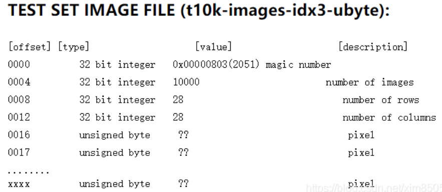
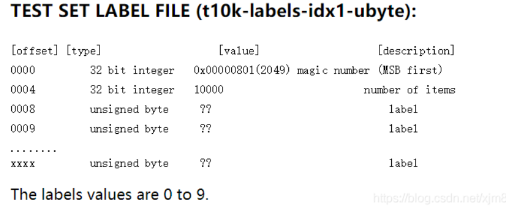

# 利用 RNN 网终实现 MINIST 手写体数字库的识别

## **MNIST 数据集**

| 名称                       | 大小     | 内容                          |
| :------------------------- | -------- | ----------------------------- |
| train-images-idx3-ubyte.gz | 9,681 kb | 55000 张训练集，5000 张验证集 |
| train-labels-idx1-ubyte.gz | 29 kb    | 训练集图片对应的标签          |
| t10k-images-idx3-ubyte.gz  | 1,611 kb | 10000 张测试集                |
| t10k-labels-idx1-ubyte.gz  | 5 kb     | 测试集图片对应的标签          |

· Image 文件内容：offset=16 前 16 位跳过不读，后面为图片像素*28*28

· Lable 文件内容：offset=4 前 4 位跳过不读，后面为标签 - byte 0~9

## **小注**

### 1. transforms.ToTensor()

### 2. transforms.ToTensor()

一个图像预处理方法，用于将 PIL 图像或 NumPy 数组转换为 PyTorch 中的张量（torch.Tensor）

-   将 PIL 图像转换为 NumPy 数组。
-   将 NumPy 数组中的每个像素的值从 0 到 255 的整数转换为 0 到 1 的浮点数。
-   将 NumPy 数组转换为 PyTorch 中的张量，并交换维度顺序，使得通道数在第二个维度上。
     
    <code> #创建预处理管道 
    preps = transforms.Compose([transforms.Resize((224, 224)),transforms.ToTensor()])
      -- 处理后的图像转化为张量：
      输出一个大小为 (3, 224, 224) 的浮点数张量，第一个维度表示通道数，后两个维度表示图像宽和高。
    </code>
